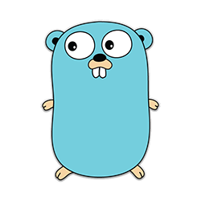

### Bienvenidos al Curso de Go:
# DE CERO A MAESTRO JEDI

Este curso esta pensado para que aprendas todo lo necesario para iniciarte en *Go* desde **cero a experto.**

Comenzando desde los conceptos básicos, siempre siguiendo la **documentación oficial** y desarrollando ejemplos útiles en código.

## Organización del curso

##### Parte I: Una nueva esperanza.
Introducción y conceptos básicos: Seguiremos el orden de temas propuesto por el *Go Tour* acompañado de ejemplos prácticos.

##### Parte II:  El despertar de la fuerza.
Pondremos en practica los conocimientos adquiridos en la primer parte implementando una serie de ejemplos:

- Servicio web REST/JSON
- Conexión con Oracle y MySQL
- Conexión con MongoDB
- JSON Web Tokens
- Login OAuth2
- Crypto

"Una nueva esperanza" y "El despertar de la fuerza" son marca registradas ® de Walt Disney Company.
