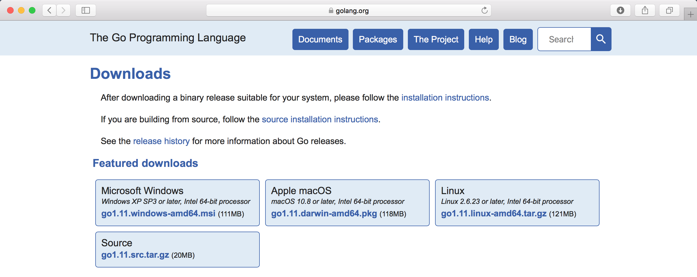

## Instalación de Go

#### Pasos a seguir

- Descargar e instalar el binario
- Comprobar las variables de entorno
- Instalar un versionador de código
- Comprobar la instalación

#### Variables de entorno

##### `GOROOT`
Valores predeterminados:

| OS | PATH |
| ------ | ------ |
| Windows | C:\Go |
| Linux y Mac | /usr/local/go |

##### `GOPATH`

Se utiliza para:
- Ubicación del código fuente
- Listar los workspaces
- Importación de paquetes

| OS | PATH | EJEMPLO |
| ------ | ------ | ------ |
| Windows | %USERPROFILE%/go | C:\Users\TU_USUARIO\go |
| Linux | $HOME/go | /home/TU_USUARIO/go |
| Mac | $HOME/go | /home/TU_USUARIO/go |

 Listar directorios en GOPATH:

| OS | SEPARADOR | EJEMPLO |
| ------ | :------: | ------ |
| Linux y Mac | : | GOPATH="/home/go:/other/gopath" |
| Windows | ; | GOPATH="%USERPROFILE%/go;C:\other\gopath" |
 
Estructura de directorios para GOPATH:

- src
- bin

Ejemplo:

        $GOPATH/
            src/
                github.com/user/repo/
                    mypkg/
                        mysrc1.go
                        mysrc2.go
                    cmd/mycmd/
                        main.go
            bin/
                mycmd

#### Versionadores de código

| COMANDO | VERSIONADOR |
| ------ | ------ |
| git | [Git](http://git-scm.com/downloads) |
| svn | [Subversion](http://subversion.apache.org/packages.html) |
| hg | [Mercurial](https://www.mercurial-scm.org/downloads) |
| bzr | [Bazaar](http://wiki.bazaar.canonical.com/Download) |

#### Referencias

* https://golang.org/doc/install
* https://github.com/golang/go/wiki/GoGetTools
___

###### Página: [1](./lectura-1.md), [2](./lectura-2.md), [3](./lectura-3.md), [4]
